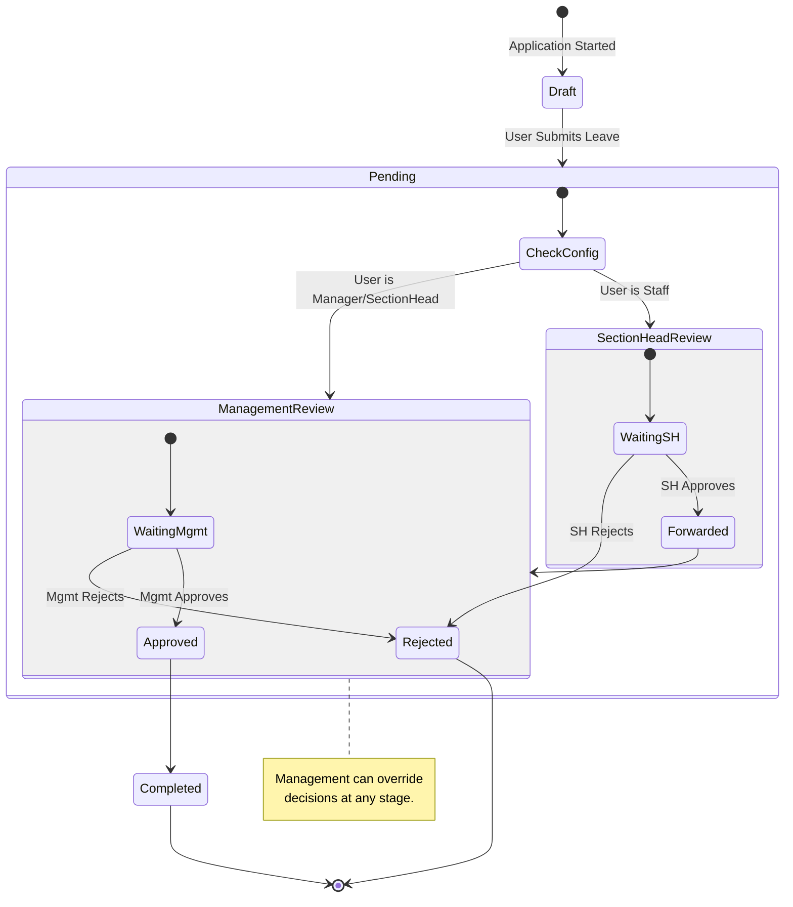
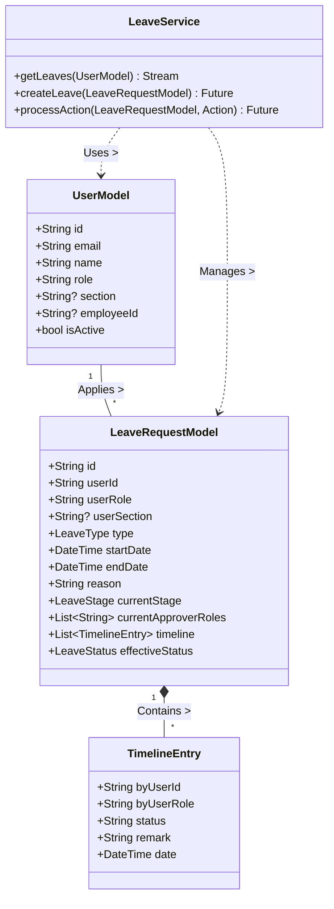

# System Documentation: SMRS (Supermarket Staff Management System)

## 1. General Background
SMRS (Supermarket Staff Management System) is a cross-platform mobile application developed using Flutter. It is designed to streamline and automate the workforce management processes of a supermarket, specifically focusing on leave management, staff administration, and role-based access control. The system provides a centralized platform for staff to request leaves and for management to review, approve, or reject these requests based on a hierarchical workflow.

## 2. Objective
The primary objectives of the SMRS system are:
*   **Automation:** To replace manual paper-based or ad-hoc leave request processes with a digital, automated workflow.
*   **Efficiency:** To reduce the time taken for leave approvals by routing requests directly to the correct authorities (Section Heads, Managers, Management).
*   **Transparency:** To provide real-time status updates (Pending, Approved, Rejected) to applicants and reviewers.
*   **Hierarchy Management:** To enforce organizational structure in decision-making, ensuring that Section Heads review their team's requests before they reach upper management.
*   **Record Keeping:** To maintain an immutable digital history of all actions taken on a leave request for audit and reference purposes.

## 3. Scope
The scope of the SMRS project includes:
*   **User Management:** Creation and administration of user profiles with specific roles (Staff, Section Head, Manager, HR, Management, Super Admin).
*   **Authentication:** Secure login mechanism using Email/Password authentication.
*   **Dashboarding:** Role-specific dashboards that present relevant data (e.g., Staff see their status, Section Heads see their team's requests).
*   **Leave Management:**
    *   Application for various leave types (Full Day, Half Day, etc.).
    *   Multi-stage approval workflows (Section Head -> Management/HR).
    *   Action tracking via a timeline (Approve, Reject, Forward).
*   **System Configuration:** Dynamic configuration of leave workflows (defining approvers for specific roles).
*   **Offline Capability:** (Planned/Partial) Ability to function in low-connectivity environments (transitioning away from cloud-heavy dependencies where possible).

## 4. Module Description

### 4.1. Authentication Module
*   **Function:** Handles user identification and access control.
*   **Features:** Login with Email/Director, Password reset, Session management.

### 4.2. Dashboard Module
*   **Function:** The central hub for user navigation and information.
*   **Features:**
    *   **Staff View:** Shows personal leave stats and current request status.
    *   **Section Head View:** Shows pending requests from their section.
    *   **Management View:** High-level overview of all requests and "My Leaves" for their own requests.

### 4.3. Leave Module
*   **Function:** The core business logic for leave processing.
*   **Features:**
    *   **Request Form:** Fields for Date, Type, Reason.
    *   **Workflow Engine:** Automatically routes the request to the correct approver based on the applicant's role and section. Supports dynamic "relevant roles" logic.
    *   **Review Interface:** Allows approvers to Approve, Reject, or Forward requests with optional remarks.
    *   **Timeline:** Visual history of who did what and when.

### 4.4. Admin Module
*   **Function:** System administration and staff onboarding.
*   **Features:**
    *   **Manage Staff:** Add, edit, or deactivate user accounts.
    *   **Flow Configuration:** Customize the approval chain for different roles.

## 5. System Environment
*   **Frontend Framework:** Flutter (Dart) - SDK >=3.10.0 <4.0.0.
*   **State Management:** Riverpod & Flutter Hooks.
*   **Routing:** GoRouter.
*   **Backend/Database:** Google Firebase (Firestore) for NoSQL data storage.
*   **Authentication:** Firebase Auth.
*   **UI Library:** Material Design with Google Fonts and Lucide Icons.
*   **OS Support:** Windows (Primary Development), Android, iOS.

## 6. Actors and their Roles
The system defines the following actors via the `AppRoles` constants:

1.  **Staff:** Entry-level employees. Can apply for leave and view their own history.
2.  **Section Head:** Leads a specific department (e.g., Bakery, Vegetable).
    *   *Role:* First-level approver for staff in their section. Can apply for their own leave.
3.  **Manager:** Store-level managers.
    *   *Role:* Can review leaves (depending on config) and apply for their own leave.
4.  **HR (Human Resources):**
    *   *Role:* Oversees all leave records, acts as a reviewer in the management stage.
5.  **Management:** Generic high-level management role.
    *   *Role:* Final authority on leave requests. Can override lower-level decisions.
6.  **MD (Managing Director) & EXD (Executive Director):**
    *   *Role:* High-level executives, typically part of the final approval chain.
7.  **Super Admin:**
    *   *Role:* Technical administrator with full access to system configuration and user management.

## 7. Diagrams

### 7.1. Use Case Diagram

```mermaid
usecaseDiagram
    actor Staff
    actor SectionHead
    actor Management
    actor Admin

    package "SMRS System" {
        usecase "Login" as UC1
        usecase "Apply for Leave" as UC2
        usecase "View Leave Status" as UC3
        usecase "Review Section Leaves" as UC4
        usecase "Review All Leaves" as UC5
        usecase "Manage Users" as UC6
        usecase "Configure Workflows" as UC7
    }

    Staff --> UC1
    Staff --> UC2
    Staff --> UC3

    SectionHead --> UC1
    SectionHead --> UC2
    SectionHead --> UC4
    SectionHead --|> Staff : Inherits

    Management --> UC1
    Management --> UC2
    Management --> UC5
    
    Admin --> UC1
    Admin --> UC6
    Admin --> UC7
```

### 7.2. Activity Diagram (Leave Approval Workflow)



### 7.3. Class Diagram


